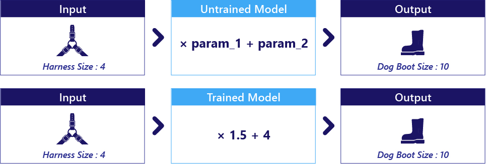
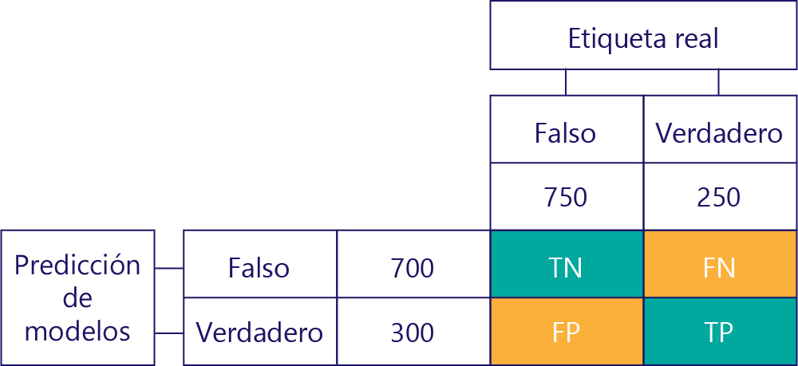
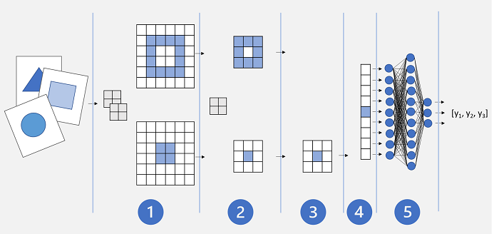

# **Microsoft Certified: Azure Data Scientist Asociate**
## **Temario**
- [**Microsoft Certified: Azure Data Scientist Asociate**](#microsoft-certified-azure-data-scientist-asociate)
  - [**Temario**](#temario)
  - [**Fundamentos de la ciencia de datos para el aprendizaje automático**](#fundamentos-de-la-ciencia-de-datos-para-el-aprendizaje-automático)
    - [**Introducción al aprendizaje automático**](#introducción-al-aprendizaje-automático)
      - [**¿Qué son los modelos de aprendizaje automático?**](#qué-son-los-modelos-de-aprendizaje-automático)
    - [**Creación de modelos de aprendizaje automático clásicos con aprendizaje supervisado**](#creación-de-modelos-de-aprendizaje-automático-clásicos-con-aprendizaje-supervisado)
    - [**Introducción a los datos para el aprendizaje automático**](#introducción-a-los-datos-para-el-aprendizaje-automático)
      - [**Datos continuos, ordinales y categóricos**](#datos-continuos-ordinales-y-categóricos)
      - [**Vectores one-hot**](#vectores-one-hot)
    - [**Exploración y análisis de datos con Python**](#exploración-y-análisis-de-datos-con-python)
      - [**Exploración de datos - NumPy y Pandas**](#exploración-de-datos---numpy-y-pandas)
    - [**Aprendizaje y conocimiento de los modelos de regresión en el aprendizaje automático**](#aprendizaje-y-conocimiento-de-los-modelos-de-regresión-en-el-aprendizaje-automático)
    - [**Mejora y prueba de modelos de Machine Learning**](#mejora-y-prueba-de-modelos-de-machine-learning)
      - [**Normalización y estandarización**](#normalización-y-estandarización)
      - [**Conjuntos de datos de prueba y entrenamiento**](#conjuntos-de-datos-de-prueba-y-entrenamiento)
    - [**Entrenamiento y evaluación de modelos de regresión**](#entrenamiento-y-evaluación-de-modelos-de-regresión)
      - [**Mejora de los modelos con hiperparámetros**](#mejora-de-los-modelos-con-hiperparámetros)
      - [**Preprocesamiento de datos**](#preprocesamiento-de-datos)
      - [**Características de escalada**](#características-de-escalada)
      - [**Uso de categorías como características**](#uso-de-categorías-como-características)
    - [**Creación y descripción de modelos de clasificación en el aprendizaje automático**](#creación-y-descripción-de-modelos-de-clasificación-en-el-aprendizaje-automático)
      - [**Evaluación de un modelo de clasificación**](#evaluación-de-un-modelo-de-clasificación)
      - [**Mejora de los modelos de clasificación**](#mejora-de-los-modelos-de-clasificación)
    - [**Selección y personalización de arquitecturas e hiperparámetros mediante bosques aleatorio**](#selección-y-personalización-de-arquitecturas-e-hiperparámetros-mediante-bosques-aleatorio)
    - [**Matriz de confusión y desequilibrios de datos**](#matriz-de-confusión-y-desequilibrios-de-datos)
      - [**Desequilibrio de datos**](#desequilibrio-de-datos)
    - [**Medición y optimización del rendimiento del modelo con ROC y AUC**](#medición-y-optimización-del-rendimiento-del-modelo-con-roc-y-auc)
    - [**Entrenamiento y evaluación de modelos de agrupación en clústeres**](#entrenamiento-y-evaluación-de-modelos-de-agrupación-en-clústeres)
    - [**Entrenamiento y evaluación de modelos de aprendizaje profundo**](#entrenamiento-y-evaluación-de-modelos-de-aprendizaje-profundo)
      - [**Entrenamiento de una red neuronal profunda**](#entrenamiento-de-una-red-neuronal-profunda)
      - [**Redes neuronales convolucionales**](#redes-neuronales-convolucionales)
      - [**Transferencia de aprendizaje**](#transferencia-de-aprendizaje)
  - [**Exploración de las herramientas visuales para el aprendizaje automático**](#exploración-de-las-herramientas-visuales-para-el-aprendizaje-automático)
  - [**Creación y funcionamiento de soluciones de aprendizaje automático con Azure Machine Learning**](#creación-y-funcionamiento-de-soluciones-de-aprendizaje-automático-con-azure-machine-learning)
  - [**Creación y funcionamiento de soluciones de aprendizaje automático con Azure Databricks**](#creación-y-funcionamiento-de-soluciones-de-aprendizaje-automático-con-azure-databricks)
## **Fundamentos de la ciencia de datos para el aprendizaje automático**
### **Introducción al aprendizaje automático**
#### **¿Qué son los modelos de aprendizaje automático?**
- Modelo: Componente principal de ML, y es lo que se intenta crear.
- Planteamiento: Como función que acepta datos de entrada y genera salida.

- Selección de un modelo: Se elige en función de su lógica interna. Más no en función de sus valores de parámetro

- Detección de los parámetros: Se define una estimación inicial y luego de ajustan durante el entrenamiento.

- Los modelos se entrenan con datos y dos fragmentos de código: **función objetivo** y **optimizador**. 

Objetivo|Datos|Optimizador
---|---|---
Conocido como función de costo, y evalúan si el modelo es eficaz|Información que proporcionamos a la función objetivo|Cambia los parámetros del modelo para que sea más eficaz la próxima vez.

- Datos para usar, datos para entrenar: Cuando usamos modelo solo debemos pasar en la entrada las columnas denominadas características. Durante el entrenamiento normalmente necesita saber tanto salida como entrada.
- Al finalizar un entrenamiento, se puede guardar el modelo en un archivo.
### **Creación de modelos de aprendizaje automático clásicos con aprendizaje supervisado**
- **Aprendizaje sin supervisión**: Se entrena un modelo para resolver un problema sin saber la respuesta correcta. Se usa para problemas con solución mejor y peor, más no correcta.
- **Aprendizaje supervisado**: Aprende basado en ejemplos. Se evalua el rendimiento mediante comparación con respuesta correcta. 
- **Reducción de los errores del modelo con funciones de costo**: Costo, también conocidas como función objetivo.
  - **Reducción de costo es nuestro objetivo**: Costo indica ineficacia del modelo, se intenta llegar a costo cero. También debemos definir el costo, como por ejemplo un error al calcular la temperatura.
  - **Función de costo**: Fragmento de código 
- **Optimización de modelos mediante el descenso de gradiente**: El descenso de gradiente es el algoritmo de optimización más común. Calcula la pendiente de la relación entre cada parámetro y el costo. Luego, modifica estos parámetros para bajar la pendiente. Tiene dos fuentes de error:
  - **Mínimos locales**: No conocer de antemano la relación completa entre cada parámetro y el costo
  - **Inestabilidad**: Los ajustes son o demasiado lejos o muy cerca, haciendo que en cada iteración varie demasiado o muy poco (casí sin cambios). Para cada problema hay un tamaño de paso óptimo.
### **Introducción a los datos para el aprendizaje automático**
- Datos deben ser representativos en cantidad, sin errores y con información clave
- "Representativo": Poblaciones y muestras
- Error de datos: Pueden distorsionar un modelo. Existe errores de medición, al momento de recopilar datos, dificil de eliminar. Los errores de entrada se escribieron de forma incorrecta.
- Datos completos. Si no se tuvieran, podemos:
  - Elegir un modelo que funcione con datos incompletos (Preferible)
  - Quitar las filas con datos incompletos
  - Agregar valores razonables como sustitutos
#### **Datos continuos, ordinales y categóricos**
- Datos ordinales son datos categóricos con un orden: grande > mediano > pequeño
- Identificadores: clase especial de datos categóricos
#### **Vectores one-hot**
- No tiene sentido agregar una especie de "menor que" en valores categóricos. Puerta1 < Puerta2 < Puerta3.
- **Codificación one-hot**: Cada categoría disponible obtiene su columna propia
- Su uso puede ser positivos o negativo
- **Potencia estadística**: Capacidad de un modelo para identificar de forma confiable relaciones reales entre características y etiquetas. Se ve afectada ante falta de datos, columnas sin valor, columnas excesivas sin información relevante, etc.
- Codificación one-hot reduce potencia estadística. Merece la pena si el número de categorías es menor que número de muestras y que la categoría proporciona información relevante.
### **Exploración y análisis de datos con Python**
- El rol de científico de datos: implica exploración y análisis de datos
- Los resultados de analísis constituyen la base de un informe o un modelo de ML
#### **Exploración de datos - NumPy y Pandas**
- NumPy: Funcionalidad comparable con MATLAB y R
- Pandas: Como el Excel de Python
- Prueba de hipótesis: Proceso iterativo en que se toma una muestra de datos y realiza tareas para analizar y probar hipótesis:
  - Limpiar datos
  - Aplicar técnicas estadísticas para comprender mejor los datos
  - Visualizar datos para determinar relaciones entre variables o identificar que características son potenciales para predecir etiquetas.
  - Revisión de hipótesis y repetir proceso
### **Aprendizaje y conocimiento de los modelos de regresión en el aprendizaje automático**
- Regresión: Identifica la intensidad de la relación entre 1 o más características y una sola etiqueta.
- Regresión lineal simple: Relación entre 1 características y 1 etiqueta normalmente continua `y = mx + c`. y: etiqueta, x: característica. No requiere tanta afinación.
- Regresión líneal múltiple: Relación entre varias características y 1 etiqueta. Modela simultáneamente varias relaciones que trata como independientes entre sí.
  - Tiene suposiciones al esperar que las características sean independientes
- Bondad de ajuste R^2: Dentro de un rango de 0 y 1. Ayudan bastante. Tiene cuatro limitaciones:
  - Depende de la cantidad de muestras tenemos, dando diferentes resultados en un mismo modelo con diferentes cantidades de datos.
  - No nos indican como funcionará el modelo con datos nuevos
  - No indican la dirección de la relación (hacia abajo o arriba), ni el grado de inclinación de la línea.

  > No hay criterio universal que convierta un valor de R^2 en suficientemente bueno. Existen casos donde R^2 cercano a 1 no es útil, y R^2 en 0.3 se considere excelente
- Regresión polinomica: Modela relaciones con polinomios (curvas).
  - Existen otras curvas: registro y logísticas pero que no son parte de polinomios
  - Es excelente para relaciones negativas en un determinado intervalo pero positivas en otras.
  - Desventaja: Extrapola de manera errónea. Predice en el dominio de sus datos. Son fáciles de sobreajustar por el ruído de los datos.
### **Mejora y prueba de modelos de Machine Learning**
#### **Normalización y estandarización**
Escalado de características que cambia el intervalo de valores que tiene una característica.

**Normalización frente a estandarización**  

- Normalización: Modificar la escala de 0 a 1 (normalmente)
- Estandarización: Resta la media de los valores, se divide por la desviación estándar. Resultando en valor medio 0 y el 95% de los valores se encuentran entre -2 y 2.
- Existen otras formas de escalar los datos.
  **OBJETIVO: Desplazar las características a algo más cercano a la suposición inicial**
- Es un elemento estándar de la creación de modelos de ML
#### **Conjuntos de datos de prueba y entrenamiento**
- Evitar el sobreajuste diviendo el conjunto de datos en entrenamiento y otro de prueba
- Ambos conjuntos de datos terminando calculando 2 funciones de costo. Una para optimizar el modelo y otro para validar cuando se está sobreajustando
### **Entrenamiento y evaluación de modelos de regresión**
- Uso del error cuadrático medio. Menor valor, menor pérdida tendrá el modelo
#### **Mejora de los modelos con hiperparámetros**
- Hiperparámetros: valores que cambian la forma en que el modelo se ajusta durante estos bucles. (Ejm: Velocidad de aprendizaje)
#### **Preprocesamiento de datos**
- Cambios realizados en los datos antes de pasarse al modelo
#### **Características de escalada**
- Escalar para que se encuentren entre uno o cero, o usar desviación estándar.
#### **Uso de categorías como características**
- Pasar de "bicicleta", "monopatín" o "automóvil" en vectores one-hot
### **Creación y descripción de modelos de clasificación en el aprendizaje automático**
- Las salidas de los modelos de clasificación son categóricas.
- Estos tipos de modelos se usan para tomar decisiones o asignar elementos a categorías
#### **Evaluación de un modelo de clasificación**
- Pérdida de registro: Popular para la clasificación simple. Castiga las respuestas incorrectas de forma más contundentes que MSE
#### **Mejora de los modelos de clasificación**
- Proporcionar caracteríticas adicionales (columnas)
- Internamente, las características deben ser independientes
### **Selección y personalización de arquitecturas e hiperparámetros mediante bosques aleatorio**
- Arquitectura: Cuántos parámetros, y como están vinculados. En paralelo (ancho) o en serie (profundidad)?
- Árboles de decisión: Buenos para identificar características. Se sobreajustan demasiado (DEBILIDAD):
  - Un árbol más profundo, es más propenso a sobreajuste
- Bosques aleatorios: Colección de árboles de decisión. Entrenan con subconjuntos de datos cada árbol.
  - Desventaja: Dificil de comprender cada árbol como un todo.
  - Personalizar la arquitectura: Número de árboles, tamaño, profundidad, colección de características, etc.
### **Matriz de confusión y desequilibrios de datos**
- Evaluan rendimiento de un modelo categórico

#### **Desequilibrio de datos**
- Los modelos aprender a imitar estos desequilibrios
- Evitar sesgo en una matriz de confusión
### **Medición y optimización del rendimiento del modelo con ROC y AUC**
- Curvas ROC: Traza la tasa de verdaderos positivos frente a la tasa de falsos positivos.
- Área bajo la curva (AUC): Comparar las ROC numéricamente. Más perfecto sea un modelo, mayor será esta área
### **Entrenamiento y evaluación de modelos de agrupación en clústeres**
- Método no supervisado y el entrenamiento se realiza sin etiquetas.
- Agrupación en clústeres y jerárquicos
 

Permite comprender las relaciones entre estos grupos.

### **Entrenamiento y evaluación de modelos de aprendizaje profundo**
- Intenta emular el modo que el cerebro humano aprende: neuronas conectads por extensiones nerviosas.
- Al estimular la primera reurona de la red, se procesa la señal de entrada, si supera el umbral, la neurona transmite la señal a las neuronas que están conectadas.
#### **Entrenamiento de una red neuronal profunda**
- Iteraciones llamadas épocas. Asignamos valores de inicialización aleatorios para valores de ponderación (w) y sesgo (b).
- Las características con valores de etiqueta conocidos se envian a la capa de entrada en lotes.
- Neuronas aplican función, y si se activa, la pasan hasta la salida que genera una predicción.
- Predicción se compara con valor real y se calcula monto de la varianza de valor previsto y real (pérdida)
- Se calcua valor revisado de los valores de ponderación y sesgo, para reducir pérdida y estos ajustes se retropropagan a las capas
- Se repite otra época.
#### **Redes neuronales convolucionales**
- Útiles con grandes matrices de valores numéricos, como imágenes.
- Extrae características de las imágenes y envia a una red neuronal conectada para generar predicción.
- Capas: realizan una tarea específica
  - Capas convolucionales: Extrae características aplicando un filtro, definido por un kernel (consta de una matriz de valores de ponderación)
  - 
  - Capas de agrupación: (o submuestreo) para disminuir cantidad de valores de características, mientras se conservan las características diferenciales clave.
  - 
  - Capas de anulación: Elimina asignaciones de características de forma aleatoria evitando que el modelo no depende demasiado de los datos de entrenamiento
  - Capas de acoplamiento: Acoplar las asignaciones de características a un vector de valores que se puede usar como entrada para una capa totalmente conectada.
  - Capas totalmente conectadas: Arquitectura básica de la CNN
  - 
#### **Transferencia de aprendizaje**
- Aprendizaje por transferencia: modelos de redes usan sus conocimientos para adaptarse a otro objetivo
## **Exploración de las herramientas visuales para el aprendizaje automático**
- **Azure Machine Learning Studio**: Servicio en nube que simplifica tareas: preparar datos, entrenar modelo o implementar un servicio predictivo.
- Área de trabajo de Azure ML: está asociada a la suscripción de Azure.
- Puede crear cuatro tipos de recursos de procesamiento:
  - Instancias de proceso: Estaciones de trabajo para tratar con datos y modelos
  - Clústeres de proceso: Procesamiento a petición de código de experimento
  - Clústeres de inferencia: Usado por modelos entrenados
  - Proceso asociado: Vínculo a recursos de proceso de Azure existentes: VM o Databricks
- Aprendizaje automático automatizado: prueba varias técnicas y algoritmos de entrenamiento en paralelo con tus datos.
- Implementación de un servicio predictivo: Usar un servicio como Azure Container Instances (ACI) o un clúster de Azure Kubernetes Service (AKS)
- Diseñador de Azure Machine Learning: Cada proyecto sería conocido como canalización
- Pipelines: Organiza, administra y reutiliza flujos de trabajo de ML. Inicia con un conjunto de datos con el que entrenará el modelo.
- Componentes: Encapsula un paso
- Trabajo: ejecuta una tarea en un destino de proceso específicado
## **Creación y funcionamiento de soluciones de aprendizaje automático con Azure Machine Learning**
Permite:
- Proceso a petición escalable
- Almacenamiento de datos y conectividad para ingerir datos
- Orquestación de flujos de trabajo de ML
- Registro y administración de modelos
- Métricas y supervisión
- Implementación de modelos para inferencia por lotes y streaming
## **Creación y funcionamiento de soluciones de aprendizaje automático con Azure Databricks**